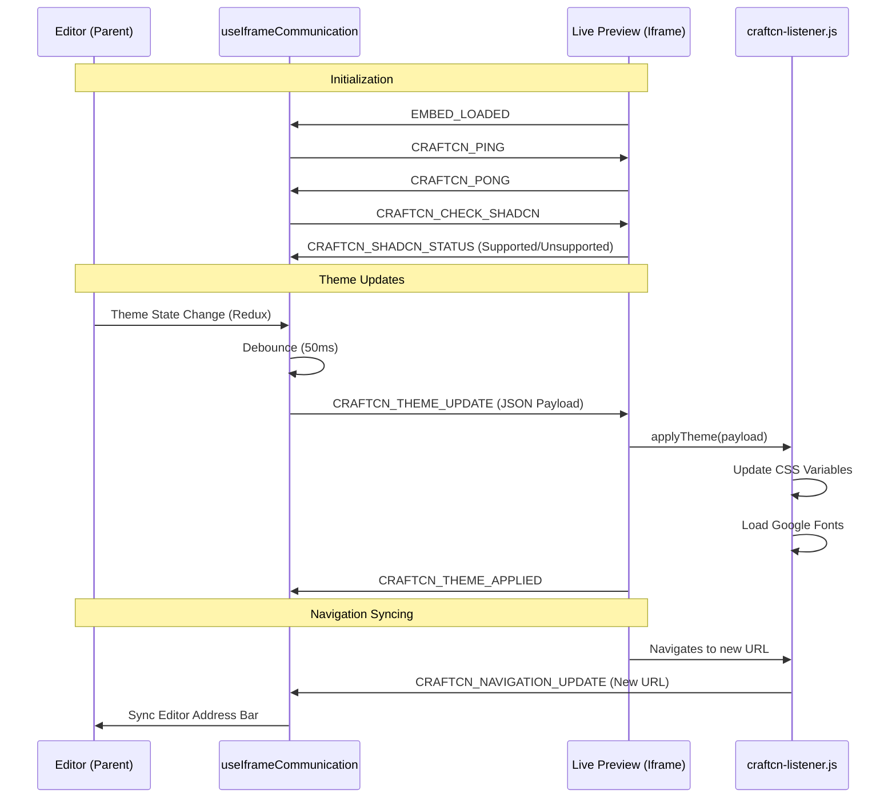

# End-to-End Communication Flow

This document details the communication bridge between the **CraftCN Editor** (Parent) and the **Live Preview** (Iframe).

## Architecture Overview

The communication relies on the browser's `Window.postMessage()` API to securely pass data across different origins.

- **Parent side:** `useIframeCommunication.ts` hook manages the state and outgoing messages.
- **Iframe side:** `craftcn-listener.js` script (embedded in the target site) listens for messages and applies styles.

## Flow Diagram

## Key Mechanisms

### 1. Handshake & Validation

To ensure the target website is ready and compatible:

- **Ping/Pong:** A watchdog timer (3s) starts when `PING` is sent. If `PONG` isn't received, the editor shows a "Script Missing" error.
- **Shadcn Check:** The listener verifies that the target site actually uses Shadcn-compatible CSS variables (e.g., `--primary`, `--background`).

### 2. Debounced Theme Updates

To prevent performance lag during rapid edits (like dragging a color slider):

- Updates are delayed by **50ms**.
- If a new change occurs before the 50ms is up, the previous update is cancelled and the timer restarts.

### 3. Style Injection

When a `THEME_UPDATE` is received, the listener:

1.  Sets CSS variables on `document.documentElement`.
2.  Toggles the `.dark` class.
3.  Dynamically appends `<link>` tags for Google Fonts.
4.  Injects a `<style>` block to override Shadow and Typography utility classes.

### 4. Navigation Sync

The listener "monkey-patches" the browser's `history.pushState` and `history.replaceState`. This allows the parent editor to stay aware of the current URL inside the iframe, even during client-side transitions.
